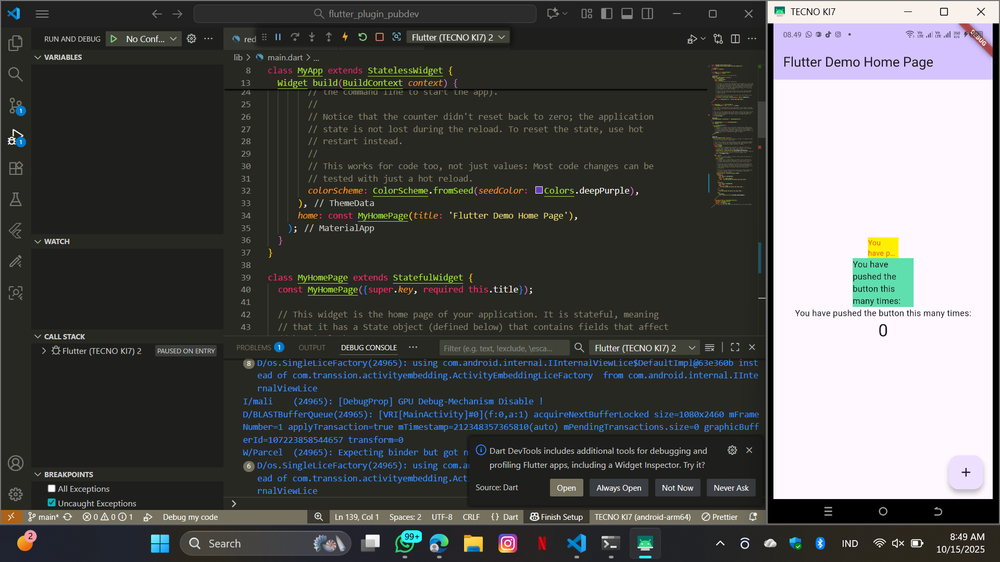

# Langkah 4: Tambah Widget AutoSizeText
Setelah Anda menambahkan kode di atas, Anda akan mendapatkan info error. Mengapa demikian? Jelaskan dalam laporan praktikum Anda!
-> Error terjadi karena pada kode tersebut terdapat pemanggilan variabel text yang tidak dideklarasikan di dalam class RedTextWidget
# Jelaskan maksud dari langkah 5 pada praktikum tersebut!
final String text digunakan untuk menyimpan teks yang akan ditampilkan. Konstruktor const RedTextWidget({Key? key, required this.text}) : super(key: key); berfungsi untuk memberi nilai pada variabel text saat widget dibuat. Kata kunci required menandakan bahwa nilai text wajib diisi ketika memanggil widget ini.
# Pada langkah 6 terdapat dua widget yang ditambahkan, jelaskan fungsi dan perbedaannya!
- Container kuning: menampilkan teks menggunakan RedTextWidget (AutoSizeText) agar ukuran huruf otomatis menyesuaikan dan tidak terpotong meski ruangnya sempit.
- Container hijau: menggunakan Text biasa untuk menunjukkan perbandingan, di mana teks bisa terpotong jika ruangnya tidak cukup.
# Done
